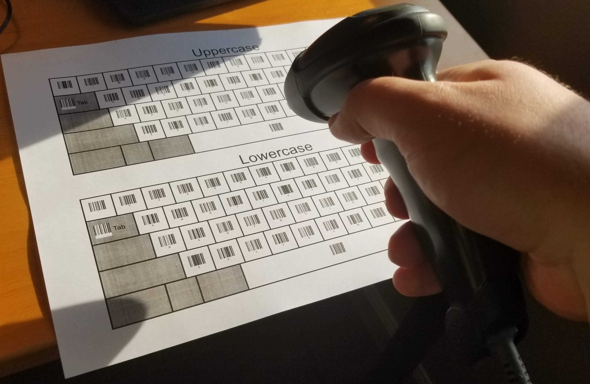
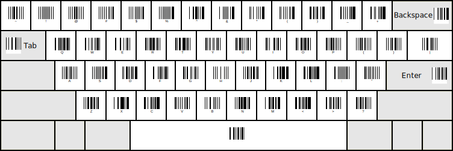
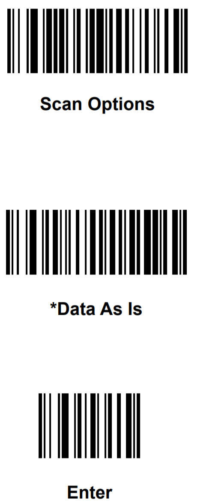
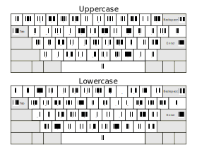

# Barcode Scanner as a Keyboard
A printout to use a barcode scanner as a keyboard.  This may be a terrible idea, but I did it anyway.

*Above: using a barcode scanner to scan the spacebar on the uppercase keyboard*

*Below: SVG of the Uppercase keyboard itself*

## Introduction and Motivation

I had an old USB laser barcode scanner sitting around that I picked up second-hand.  I'd been meaning to use it in a project somehow, but never really knew what would be a good use for it.  When plugged into a computer, it emulates a USB HID Keyboard acting as if you had manually typed the barcode in yourself, along with any other keys (for example `<RETURN>` to tell some software to accept the barcode).

Well, different barcodes can encode plenty of different ASCII characters, and the codes can be as short or as long as you want, so for some reason, I thought it would be interesting to make a printable keyboard with barcodes as the keys to scan.  It's... cool, I guess?  I at least learned a lot more about barcodes and barcode scanners than I ever thought I would know in the process of making this. `:-)`

## Hardware

My barcode scanner is a Symbol LS2208-SR20007, but plenty of other barcode scanners should be compatible as long as they can do the following:

- Read Code-128 barcodes 
- Read *small* barcodes (if you print the keyboard on regular-sized paper)
- Emulate a USB Keyboard
- Enter barcodes without any additional characters or keypresses

### Note about extra keypresses

When I first purchased it, my barcode scanner added extra characters when I scanned a barcode. For example, if I scanned a barcode containing the numbers '1234', it would type `|1234<RETURN>`.  Since my barcode scanner was purchased used, I don't know if this was the default from the factory.

Reading the [manual for this scanner](https://www.zebra.com/content/dam/zebra_new_ia/en-us/manuals/barcode-scanners/ls2208-product-reference-guide-en-us.pdf), I was able to find the sequence of special programming barcodes that I scanned in order to force the barcode scanner to enter the barcode exactly as typed

- That sequence of barcodes is as follows (Different scanners will vary, of course): 

## The Keyboard

The keyboard is composed of dozens of individual Code-128 barcodes that look like this:

This is a barcode containing the letter `A` and nothing else. 

By scanning barcodes like this one in sequence, it's possible to type entire words.  To organize all of these barcodes I placed them into a graphic of a standard keyboard [modified from this public-domain graphic on wikipedia.](https://commons.wikimedia.org/wiki/File:Sun_Type_5c_keyboard_layout_(US).svg)

Since the barcode specifically encode individual characters, not keystrokes, meaning there is no way to press `SHIFT`, I needed to make separate keyboards for the uppercase and lowercase letters.

Combined together, the two keyboards are able to fit on an 8.5x11 sheet of paper. I have provided a printable graphic for this as `full_page_keyboards.svg`:

## How it was made

After downloading [a graphic of a keyboard from wikipedia,](https://commons.wikimedia.org/wiki/File:Sun_Type_5c_keyboard_layout_(US).svg) I used [Inkscape](https://inkscape.org/) to remove keys that weren't needed, and to clear out all of the text.

Then, I used an [online tool](https://barcode.tec-it.com/en/Code128) to generate each of the barcodes for every possible key on the keyboard that I could match up with one.  I individually placed each barcode on the keyboards in its appropriate location, and I was ready to print!

I needed to adjust sizes and the location of each barcode a few times, since they were sometimes too close together to use, or so close to the lines between the keys that it interfered with the scanner.

## Usage, Usability, and Limitations

The keyboard is a pain to use, but with practice, it actually becomes surprisingly functional.  I'd never want to type more than two sentences with the thing and I can only hit about 1 key per second at top speed, but if this was, for some horrible reason, the only way I could enter text into a computer, I would be able to get something basic done with it.

See [above](#Barcode-Scanner-as-a-Keyboard) for an image of what it looks like in-use (scanning the spacebar of the Uppercase keyboard)

It's a bit finicky since I have to hold the scanner at a certain range of distances and angles to get it to read properly, and from those distances, since the barcodes are so close, it often can end up scanning the code next to the key you're aiming at.  With a bit of practice, it's possible to achieve a fairly good accuracy rate, but you'll stil be reaching for that backspace code quite often.

This is a very fixable problem, though.  Simply take a 3"x5" notecard and carefully cut out a square in the center that's a bit bigger than the size of a barcode.  Using this card, you can move it over the key you're trying to scan and it will cover up the nearby codes so you won't have to worry about mis-scans.  I tested this out as well and my accuracy went up to be nearly perfect, and with enough practice I was much faster than my previous speed because I didn't need to waste so much time scanning the backspace code over and over.

### Special Key Restrictions

*This may be specific to my scanner, but plenty of other scanners could have the same problem*

When I scan special keys such as `<TAB>`, `<BACKSPACE>`, and `<RETURN>`, my scanner doesn't actually type those keys as they would on a standard USB keyboard... it uses sequences you would use on a terminal, e.g., `<CTRL> + H` instead of `<BACKSPACE>`.  For most computers and common applications, these don't work so well.  But, when I use XShell or PuTTY on my computer to ssh into a Unix machine, the scanner works perfectly in `bash`.  In `nano`, however, I run into trouble since some of those `<CTRL> + <Key>` sequences are reserved for other functionality.

So, for anything other than basic typing, it can be hit-or-miss whether the application you're using will support it.  But, again, different scanners may vary in the way they emulate a keyboard, and perhaps even a different type of barcode would make a difference.

## Future Ideas

- One of the main challenges in using the keyboard is just the amount of precision needed in aiming the scanner at the right barcode.  It would be interesting to print the keyboard out onto a significantly larger piece of paper (say, poster-size?) to allow for much more distance between the 'keys'.  On something that large, it would be much easier to have good accuracy without needing to cover up nearby codes.  It would, of course, be impossible to put that on a desk, and you would need to hang it somewhere nearby and be standing up in front of it to use it.  Wouldn't that be quite a spectacle?

- A better scanner might also help the process.  My model is a relatively low-end one that relies on a laser to work, and newer models sometimes have actual cameras inside of them that might be able to be closer to the keyboard when scanning

    - These scanners also support 2-dimensional barcodes which can encode a lot more information in a much smaller space.  This could help with the barcode density on the keyboard

- Additionally, while the classic QWERTY-style keyboard is easy for anyone to immediately understand when looking at it, it's 'short-and-wide' layout is good for two hands to type on... not for a a 1-d barcode scanner to scan on.  If the keys were rearranged on the printout to be in a more-square arrangement with fewer barcodes side-by-side, it would be much easier to ensure the correct code was being picked up by the scanner

- One actual use of this method of user-input could be for complex macros.  Rather than assigning them to a set of keyboard keys that needs memorized, macros in barcode-form are able to be described and printed on a plain sheet of paper, and the only limit in entering them is in the amount of time it takes to pull out the paper and the scanner, no memorization required, no special software required.  (2-dimensional barcodes work even better for this since they encode a lot more information a lot more compactly)

## Conclusion

This project was kind-of fun for me to work on, but has incredibly few practical implications.  I would never use this as an input method in my life, and if anyone has even the slightest use for this, I would be dumbfounded.  I think I'll be putting my scanner away for a little while now; the sight of a laser-line already fills me with dread `;-)`