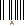

# Barcode Scanner as a Keyboard
A printout to use a barcode scanner as a keyboard.  A bad idea, but it can be done.

## Introduction and Motivation

I had an old USB laser barcode scanner sitting around that I picked up second-hand.  I'd been meaning to use it in a project somehow, but never really knew what would be a good use for it.  When plugged into a computer, it emulates a USB HID Keyboard acting as if you had manually typed the barcode in yourself, along with any other keys (for example `<RETURN>` to tell some software to accept the barcode).

Well, different barcodes can encode plenty of different ASCII characters, and the codes can be as short or as long as you want, so for some reason, I thought it would be cool to make a printable keyboard with barcodes as the keys to scan.  It's... cool?  I at least learned a lot more about barcodes and barcode scanners than I ever thought I would know in the process of making this.

## Hardware

My barcode scanner is a Symbol LS2208-SR20007, but plenty of other barcode scanners should be compatible as long as they can do the following:

- Read Code-128 barcodes 
- Read *small* barcodes (if you print the keyboard on regular-sized paper)
- Emulate a USB Keyboard
- Enter barcodes without any additional characters or keypresses

### Note about extra keypresses

When I first purchased it, my barcode scanner added extra characters when I scanned a barcode. For example, if I scanned a barcode containing the numbers '1234', it would type `|1234<RETURN>`.  Since my barcode scanner was purchased used, I don't know if this was the default from the factory.

Reading the [manual for this scanner](https://www.zebra.com/content/dam/zebra_new_ia/en-us/manuals/barcode-scanners/ls2208-product-reference-guide-en-us.pdf), I was able to find the sequence of special programming barcodes that I scanned in order to force the barcode scanner to enter the barcode exactly as typed

- That sequence of barcodes is as follows (Different scanners will vary, of course): 

## The Keyboard

The keyboard is composed of dozens of individual Code-128 barcodes that look like this:

This is a barcode containing the letter `A` and nothing else. 

By scanning barcodes like this one in sequence, it's possible to type entire words.  To organize all of these barcodes I placed them into a graphic of a standard keyboard [modified from this public-domain graphic on wikipedia.](https://commons.wikimedia.org/wiki/File:Sun_Type_5c_keyboard_layout_(US).svg)

Since the barcode specifically encode individual characters, not keystrokes, meaning there is no way to press `SHIFT`, I needed to make separate keyboards for the uppercase and lowercase letters.

Combined together, the two keyboards are able to fit on an 8.5x11 sheet of paper. I have provided a printable graphic for this as `full_page_keyboards.svg`:

## How it was made

After downloading [a graphic of a keyboard from wikipedia,](https://commons.wikimedia.org/wiki/File:Sun_Type_5c_keyboard_layout_(US).svg) I used [Inkscape](https://inkscape.org/) to remove keys that weren't needed, and to clear out all of the text.

Then, I used an [online tool](https://barcode.tec-it.com/en/Code128) to generate each of the barcodes for every possible key on the keyboard that I could match up with one.  I individually placed each barcode on the keyboards in its appropriate location, and I was ready to print!

I needed to adjust sizes and the location of each barcode a few times, since they were sometimes too close together to use, or so close to the lines between the keys that it interfered with the scanner.

## Usage, Usability, and Limitations

The keyboard is a pain to use, but with practice, it actually becomes surprisingly functional.  I'd never want to type more than two sentences with the thing and I can only hit about 1 key per second at top speed, but if this was, for some horrible reason, the only way I could enter text into a computer, I would be able to get something basic done with it.

Here's an image of what it looks like in-use (scanning the spacebar of the Uppercase keyboard)

### special key restrictions